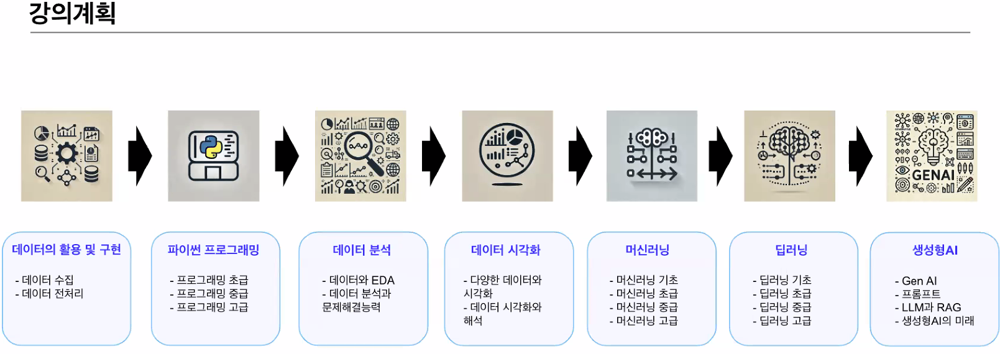

# 1주차 첫 강의

## 강의 계획 

* Git 세팅

## 생성형 AI
### 데이터의 활용 및 구현1
* 데이터란?
1. 의사 결정 및 분석을 위한 원자재
* 데이터의 중요성
1. 의사결정 도구 - 데이터 중심 사고
2. 빅데이터 시대
3. AI

* 정형데이터
1. 구조화된 형식
2. 고정된 스키마
3. 무결석
4. 저장과 관리가 효율적
5. 데이터 분석에 ㅛ이
6. 유연성이 부족
7. RDBMS

* 비정형데이터
1. 텍스트, 이미지, 동영상 다양한 데이터 유형
2. 고정된 스키마, 구조가 없음
3. 대용량
4. 풍부한 정보량
5. 저장,분석이 어려움
6. 일관성 없는 품질
7. NoSQL

* 반정형데이터
1. 일정한 구조를 갖지만 형식이 고정되지 않은 데이터
2. 자기설명적
3. 정형데이터와 비정형데이터의 장단점 공유
4. JSON, XML

* 데이터와 인사이트
** 데이터 인사이트
1. 데이터 분석을 통해 도출된 유용한 통찰이나 정보
2. 단순히 데이터를 해석한 결과값이 아닌 의미있는 정보
3. 데이터 기반 의사결정For데이터분석가
4. 모델 성능개선, 데이터 품질 For AI개발자
5. 다양한 이해관계자가 인사잍를 활용하여 의사결정과 혁신을 이끌어 내는 것이 중요

## 데이터의 수집 방법
* 크롤링
1. 자동화된 스크립트를 사용하여 웹 페이질르 탐색하고 데이터 수집
2. 전체 사이트 또는 다수의 페이지를 탐색
3. 검색 엔진의 크로러와 유사

* 스크래핑
1. 특정 웹 페이지에서 필요한 데이터 추출
2. 웹 크롤링이 하위 집합으로서 특정 데이터만 수집

* request
1. HTTP 요청을 보내고 응답을 받기 위한 라이브러리
* BeautifulSoup
* Scarapy - 정적 웹 ㅋ롤링 강점
* selenium - 동적 웹 ㅅㅋ래핑 강점

