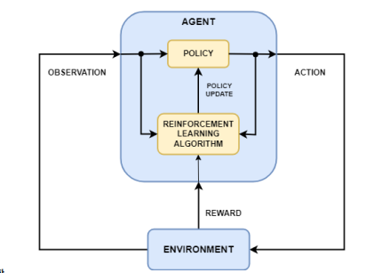

# 머신러닝
데이터에서 패턴을 학습하고, 예측하거나 의사 결정을 내리는 알고리즘

## 주요 라이브러리
### Numpy 
과학 계산을 위한 라이브러리. 고성능 다차원 배열 객체와 다양한 수학 함수들을 제공
* 다차원 배열 객체 (ndarray)
* 수학 함수 
* 배열 조작
* 빠른 계산

### Pandas
데이터 조작 및 분석을 위한 라이브러리. 데이터 전처리 및 탐색적 데이터 분석(EDA)에 사용
* 행/열로 구서된 2차우너 데이터 구조 제공
* 데이터 조작 : 데이터 정제, 결측값 처리, 데이터 병합 및 분할
* 데이터 변환 : 정렬, 필터링, 집계

### Scikit-Learn
다양한 알고리즘과 데이터 전처리, 모델 평가 기능

## 지도학습 (Supervised Learning)
* 레이블(정답)이 있는 데이터로 모델을 학습하여 새로운 데이터에 대한 예측을 수행
ex_이메일 스팸 필터링, 주식 가격 예측
### 용어
- 일반화(Generalization) : 모델이 학습데이터에서 학습한 내용을 기반으로 새로운 데이터에 대해 얼마나 잘 예측할 수 있는지를 의미
- 과대적합 (Overfiting) : 모델이 학습 데이터에 너무 잘 맞추려하여 노이즈까지 학습[규제, 교차검증, 가지치기, 앙상블로 해결]
- 과소적합 (Underfiting) : 충분히 학습하지 못한 현상[복잡한 모델 사용, 데이터양 증가]
### 프로세스
1. 데이터 수집 및 전처리
2. 훈련 데이터와 테스트 데이터로 분할
3. 모델 선택 및 학습
4. 모델 평가 및 피드백
5. 최종 모델 평가 및 배포

- 선형회귀 : 두 변수 가느이 선형 관계를 모델링
- 로지스틱 회귀 : 이진 분류 문제를 해결하는데 주로 사용
- 의사결정나무 : 데이터의 특성에 따라 의사결정을 트리 구조로 모델링
- k-NN : 가장 가까운 k개의 이웃 데이터를 기반으로 예측
비모수적 방법 - 데이터 분포에 대해 특정한 가정을 하지 않는 방법
메모리 기반, 단순함

### 지도학습 - 회귀
목표 : 연속적인 값을 예측하는 문제
- 단순 선형 회귀(y=β0​ +β1​ x+ϵ) : ex_집의 크기(독립변수)와 집값(종속 변수)사이의 관계를 분석
- 다중 선형 회귀  : ex_여러개의 변수가 집값에 영향을 미치는 경우

## 비지도학습 (Unsupervised Learning)
* 레이블이 없는 데이터에서 패턴이나 구조를 발견하는 학습 방법
ex_ 고객 세분화, 이상탐지, 차원축소

- k-means : 데이터를 k 개의 클러스터로 분할하는 군집
- PCA : 데이터의 차원을 축소하여 주요 특징을 추출
- DBSCAN : 밀도 기반 군집화
- 계층적 군집화 : 데이터의 계층적 구조를 탐색하는 군집화 알고리즘

## 강화학습
* 에이전트가 환경과 상호작용하면서 보상을 최대화 하는 행동을 학습
ex_ 게임 인공지능, 로봇 제어, 자율 주행

- 에이전트 (Agent) : 환경과 상호작용하며 학습을 수행하는 주체
- 환경  (Environment) : 에이전트의 행동에 따라 상태를 변화시켜 보상을 제공하며 상호작용하는 외부 시스템
- 상태 (State) : 환경의 현재 상태
- 정책 : 주어진 상태에서 행동을 선택하는 전략. 행동을 출력하며 최적의 정책은 에이전트가 장기적으로 최대 보상을 얻도록 함.
- 가치함수 (Vallue Function) : 특정 상태나 상태-행동 쌍의 가치를 평가하는 함수. 누적 보상의 기대값을 나타내어 최적의 행동을 선택하는데 도움을 줌

## 나이브 베이즈 (Naive Bayes)
* 조건부 확률을 이용한 분류 알고리즘, 독립 변수들이 독립적이라는 가정 하에 작동
- P(A|B) : 사건 B가 일어났을 때 사건 A가 일어날 확률 (사후확률)
ex_P(spam|words) : 특정 단어가 있을 때 스팸메일일 확률
- P(B|A) : 사건 A가 주어졌을 때 B의 조건부 확률
ex_ (words|spam) : 스팸메일에 특정 단어가 있을 확률 ->구할 수 있음
* 간단하고 빠르고 알고리즘이 단순하여 학습과 예측속도가 빠름. 
* 특성들 간의 독립 가정이 맞지 않을 수 있으며 연속형 데이터 처리에 어려움.

## 모델의 학습과 평가
* 머신러닝 모델의 성능을 정확히 평가하기 위해 전체 데이터셋을 훈련 데이터와 테스트 데이터로 분할
* 교차검증 : 모델의 일반화 성능을 평가하고, 데이터의 분할로 인한 편향을 줄이기 위한 방법
- K-Fold Cross Validation : 데이터셋을 k개의 폴드로 나누어 교차검증을 수행. k-1개의 폴드는 훈련데이터로 사용

## 모델 평가
* 혼동행렬 : 모델이 예측한 결과와 실제 결과를 비교하여 분류 오류의 유형을 확인
- TP : 모델이 참으로 예측한 결과가 실제로 참인 경우(ex_스팸이 스팸으로 분류)
- FN : 모델이 거짓으로 예측한 결과가 실제로는 참인 경우 (ex_누락된 스팸)
- FP : 모델이 참으로 예측한 결과가 실제로는 거짓인 경우 (스팸이된 정상메일)
- TN : 모델이 거짓으로 예측한 결과가 실제로도 거짓인 경우(정상메일을 정상메일로 분류) 

- 정확도(Accuracy) : 전체 예측 중 맞춘 비율
- 정밀도(Precision) : 양성 예측 중 실제 양성 비율
- 재현율(Recall) : 실제 양성 중 맞춘 비율
- F1 -score : 정밀도와 재현율의 조화평균 (0~1 - 클수록 좋음)
- ROC 곡선 : 모델의 분류 임계값을 변화시키면서 재현율과 FP를 비교하는 곡선
- AUC : ROC 곡선 아래 면적으로 모델의 전반적인 성능을 나타내며 1에 가까울 수록 좋은 모델.

